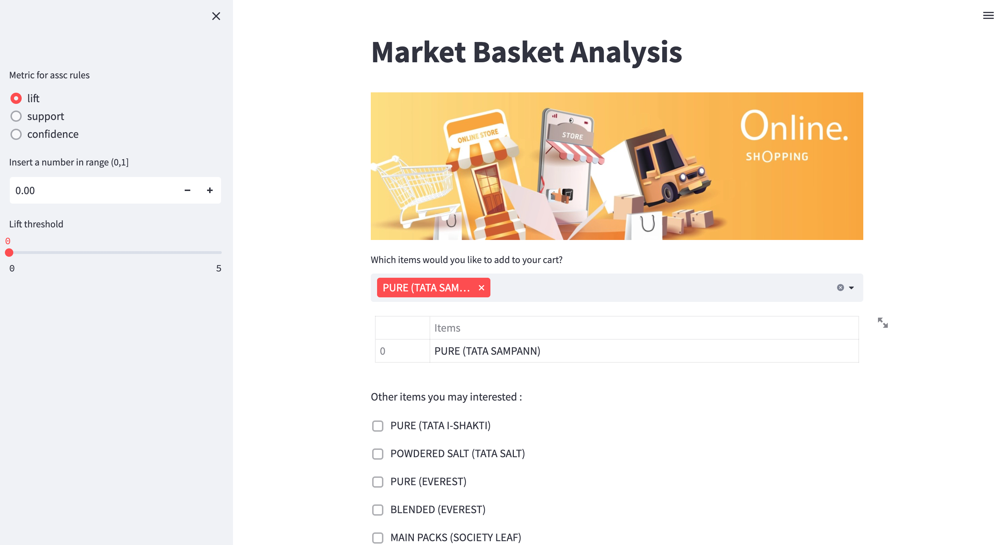

# Market Basket Analysis on E-commerce dataset
**By Thanapong (billy)**

This is the code for a Web shopping application with a recommendation system using Market Basket Analysis. I have split the output into three parts that I have organized as follows:

The first step, I source, explore, and format the dataset to be suitable to perform an MBA.

For the second part, I apply fpgrowth algorithms for Product Recommendation. Then I implement the selected model to deploy with the Streamlit Web application with an adjustable metrics of association rules for user preference.

## DATA

- [bill_data.csv](https://www.kaggle.com/datasets/iamprateek/store-transaction-data?select=Hackathon_Working_Data.csv): Store Transaction data

## Data Dictionary

|Feature|Meaning|
|---|---|
|MONTH|Month ID (M1, M2, M3)|
|STORECODE |STORE CODE (N1, N2, …, N10)|
|DAY|Day of the month|
|BILL_ID|Bill ID (T1,T2,…)|
|BILL_AMT|Bill Amount|
|QTY|Sales Unit|
|VALUE|Sales Value|
|PRICE|Selling Price Per Unit|
|GRP|Category|
|SGRP|Subcategory|
|SSGRP|Sub Sub Category|
|CMP|Company/Manufacturer|
|MBRD|Mother Brand|
|BRD|Brand|

## Streamlit Web application

